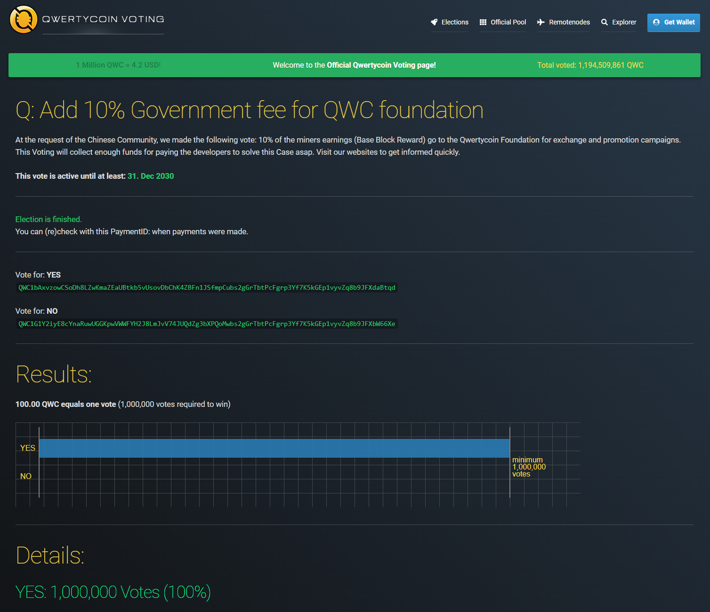

# 10% Governance Tax

The community voted on adding 10% governance tax through [https://voting.qwertycoin.org/?election=20](https://voting.qwertycoin.org/?election=20).

Please check the voting result and this governance tax will be take from the block reward and will be used for project developments.

The use of this taxed fund will be reported and monitored transparently through the wallet view key.

