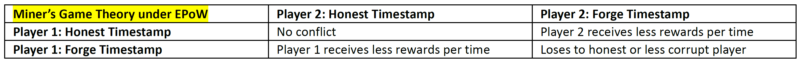

# Egalitarian Proof of Work \(EPoW\)

QWC introduces Egalitarian Proof of Work \(EPoW\) for the first time in blockchain space for protecting the blockchain from the well-known majority attacks and double-spending. This is also the first step towards EPoSe consensus.

The core team found fundamental flaws in the original CryptoNote Proof of Work because it allowed miners, especially influential groups of miners, to get more coins. Also, difficulty algorithm \(DA\) was not carefully designed to cover many different cases.

Among CryptoNote developers, some expressed concerns that the fact that the longer miners mine to find a block, the bigger the reward gets. Therefore, miners or pools is attracted to exploiting this point and get maximum rewards by setting the block timestamp in the future. This can drag mining difficulty down to the bottom as a side effect.

**EPoW reward algorithm is designed so that any forged extra time posted by a malicious actor is rather penalized for every second compared to issuing a new block with the shortest timestamp for the next block. There are simply no incentives for them to do this. QWC does not consider this argument valid. A game theory analysis of miners' behavior leads to the expected result.**

