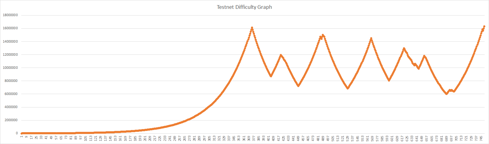

# Testnet Result

The core team has tested CIMA + Consistency and their performance up to 800X attack case scenario.

**The overall summary of this attack is:**  
  
\#1. QWC is designed to produce 720 blocks within 24 hour period. This is equivalent to 30 blocks per hour.   
  
\#2. The attack lasted for 16 hours in time and the attacker found 760 blocks. That is equivalent to 47.5 blocks per hour.  
  
\#3. The \#2 makes the situation look bad but the reality isn't. So read on.  

**So what about the number of coins the chain produced?**

**\[Within 360 blocks of attack period\]**  
  
\#4. CIMA DA reached a proper range of difficulty after 360 blocks. \(We know this because it is a controlled environment.\) The duration of these 360 blocks was 10,608 seconds, 176.8 minutes.   
  
\#5. This 176.8 minute is equivalent to 88 block time with some safe margins. So the attacker found an additional 280 blocks beyond the system design.  
  
\#6. Within the range of block heights where the test was conducted, the average block reward was 347,500 QWC per block.   
  
\#7. Without CIMA+Consistency, the attacker would have received a minimum of 125.1 million QWC for 360 blocks. This could scale to billions of QWC in the worst-case scenario.  
  
\#8. With CIMA+Consistency, the attacker found 360 blocks, yet the algorithm released 28.9 million QWC for 360 blocks.  
  
\#9. If there were no attacks or the hash rate was consistent, the network would have found 80 blocks within the same period of time and released 30.7 million QWC for 88 blocks.

**\[After DA reaching a proper range of difficulty\]**  
  
\#10. Within the range of block heights where the test was conducted, the average block reward was 347,500 QWC per block. The duration of these 400 blocks \[760-360\] was 48,289 seconds, 804.8 minutes.  
  
\#11. This 804.8 minute is equivalent to 402 block time with some safe margins. So after DA adjustment, the block time was consistent with the system design.  
  
\#11. With CIMA+Consistency, the algorithm released 97.9 million QWC. This is due to [a combination of case 1 and case 2](https://wp.qwertycoin.org/consensus/egalitarian-proof-of-work-epow/rewards-based-on-consistency) of Consistency.  
  
\#12. If there were no attacks or the hash rate was consistent, the network would have released 139.0 million QWC.  

The miners are now incapable of breaking the ceiling value of emission...completely and forever. There is no additional gain on rewards from launching a majority attack to QWC network.

**Now, let's assume that you have or can rent a massive mining power and reading this part of whitepaper wanting to mine QWC. What is your choice? Attack or not?**

