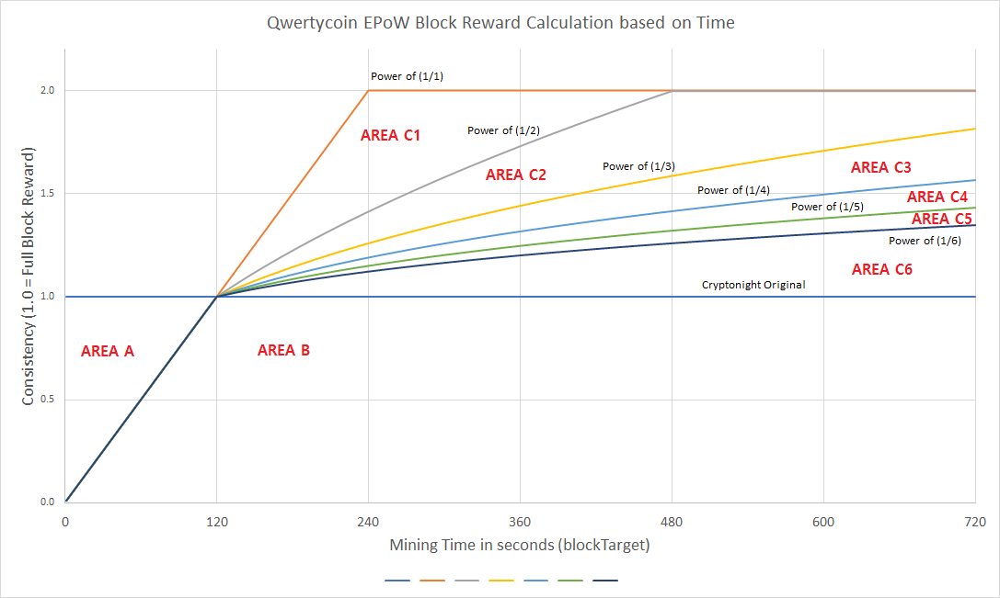

# An example of how QWC prevented CryptoNote block reward manipulation

\[Figure 6. Block Reward Adjustment with 'Consistency'\] 

Area A: An area where miners can take more coins per second if find a block within 120 seconds.  
  
Area B: An area that is bound by CN block reward schedule after 120 seconds of mining. No matter how long it takes for miners to find a block, the block reward stays at the level before 120 seconds.

Area C1 - C6: An area where block rewards will increase after 120 seconds of mining. The current block reward algorithm is set to adjust the consistency factor using a power of 1/4.

**To demonstrate the changes, the same data set was used from the example of manipulation under CN block reward schedule.**

\[Table 2. An example of mining rewards based on EPoW block reward algorithm between block 500,000 and 500,019\]

In \[Table 2\], EPoW Reward column shows an adjusted base reward for each block from the introduction of ‘consistency’

The maximum value from \[Table 2\] under EPoW reward per second is consistently at 1,132 QWC when mined less than or equal to 120 seconds and the lower bound is at 370 QWC.

The maximum value from \[Table 1\] under actual reward per second is at 10,449 QWC and the range of reward per second when a block is mined less than or equal to 120 seconds, is between 1,132 QWC and 10,449 QWC, while the lower bound is at 295 QWC.

The CN block reward schedule is now fully protected with the application of consistency because it controls the coin emission consistent over time even after providing additional rewards for extra efforts by miners if solve time for a block increases beyond the full grant zone of 120 seconds.

