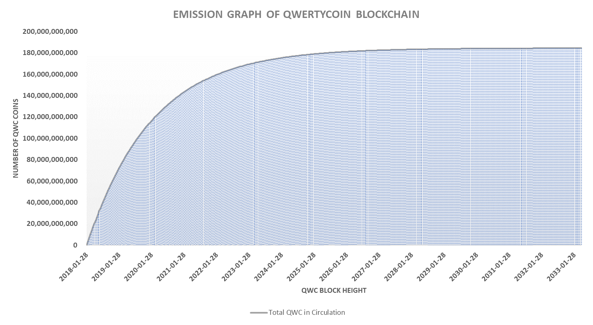

# Transition from PoW to PoS

As with any other blockchain technologies, QWC block height will increase over time, which also results in the blockchain data file growing continuously in a linear trend. With a block time of 120 seconds and 1 MB block size, QWC blockchain size can potentially increase close to **4 TB** at a **99.95%** QWC circulation rate. Even after considering the storage capacity of the consumer PC market is currently averaged at 500GB, the size of full blockchain data can be a problem for new users of QWC blockchain.

Eventually, the users of desktop wallet software are expected to connect their wallet software through remote nodes to reduce the percentage of their local hardware resource usage, while having an option to download the complete QWC blockchain data and sync in their local computers.

QWC team also realizes that

1. Block rewards against energy consumption for EPoW mining process will become inefficient for the network and harmful to our environment in the later stage of QWC blockchain.
2. Mobile wallet applications will require remote nodes \(without downloading the blockchain file\) for transactions.

Therefore, it is inevitable that QWC blockchain to shift from individual miners\(EPoW\) to competent node operators\(EPoS\) as more coins are mined towards QWC’s maximum supply limit of 184.47 billion and the adaption rate of mobile wallet application increases over time.

\[Figure 7. Blockchain Size per Block Height\]

\[Figure 8. Blockchain Size per Date\]

The appropriate timing for this transition is to be decided by the community members. In this paper, proposed timings for this change are provided in \[Table 3\] and \[Table 4\] for our members to make informed decisions.

\[Figure 9. Expected Block Rewards Emission per Date\]

\[Table 3. Expected profitability from EPoW under ASIC mining environment and Transition timing proposal from EPoW to EPoS\]

| Transition Timing Table | Proposal \#9 | Proposal \#10 | Proposal \#11 | Proposal \#12 |
| :--- | :--- | :--- | :--- | :--- |
| QWC Block Height: | 900,000 | 1,000,000 | 1,500,000 | 2,000,000 |
| Single Block Reward: | 63,200 | 52,000 | 20,000 | 7,750 |
| 24 Hour Block Reward: | 45,504,000  | 37,440,000  | 14,400,000 | 5,580,000 |
| Expected Number of Mobil Users: | 900 Users | 1,000 Users | 1,500 Users | 2,000 Users |
| Expected Storage Capacity: | 8 GB | 8.5 GB | 10 GB |  12 GB |
| Expected Net Hash Rate: | 100.0 MH | 200.0 MH | 300.0 MH | 400.0 MH |
| Expected Date of Height: | 2021.7.3 | 2021.11.18 | 2023.10.14 | 2025.9.7 |

