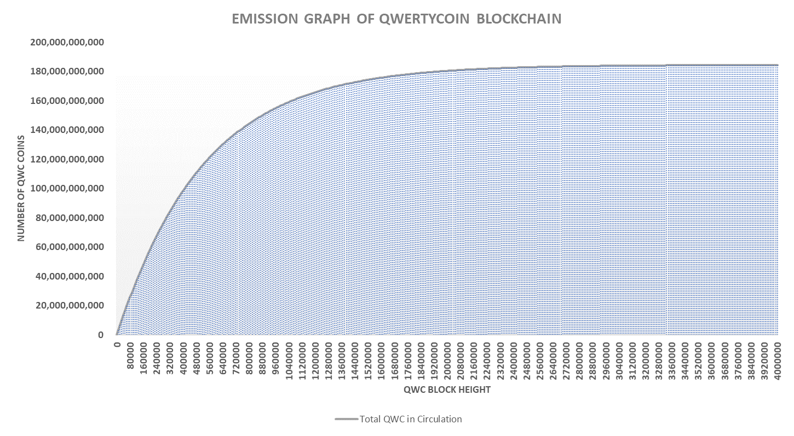
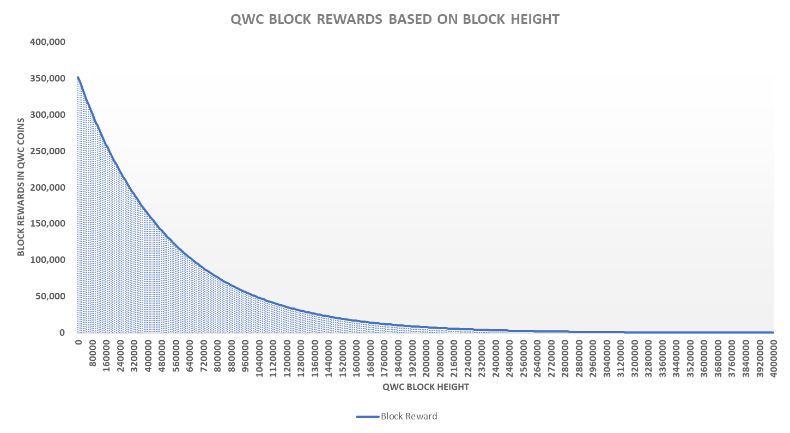
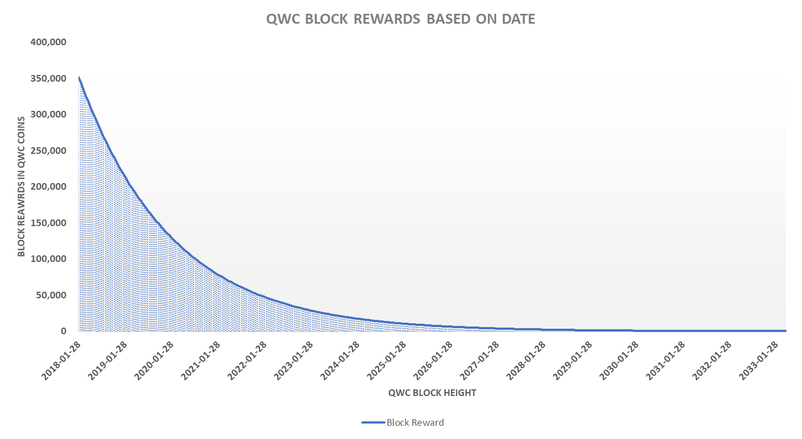
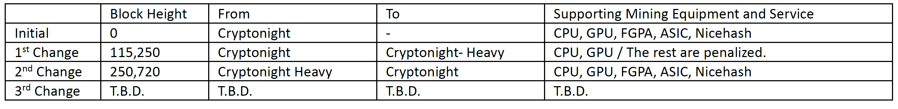

# Egalitarian Proof of Work \(EPoW - Cryptonight Variant\)

**How to Get Coins \[Mining\]: Egalitarian Proof of Work \(EPoW – Cryptonight Based Variant\)**

The word egalitarian stands for providing equal rights and equal opportunities. QWC network is an open source and is driven by community members. Anyone can join and support the network and get coins as compensation to their support through mining.

CryptoNote Technology V2.0 has a built-in block reward system called ‘emission rate’. It is a shape of log function and, because of its original design, **QWC block rewards will reduce by each block found and eventually reach a point called ‘tail emission’.**

QWC has an emission factor of 19. Please refer to below graphs to see how block rewards are reduced over time.

\[Figure 1. Total QWC in Circulation per Bloch Height\]

\[Figure 2. Total QWC in Circulation per Date\]

\[Figure 3. Block Reward Reduction per Block Height\]

\[Figure 4. Block Reward Reduction per Date\]

* History of Mining Algorithm Changes

Qwertycoin core team is committed to reflect the decisions of the community regarding major changes in the future through community voting system.

Please go to our explorer page \([https://explorer.qwertycoin.org/\#pools](https://explorer.qwertycoin.org/#pools)\) and select a pool to mine from. Each pool provides information and a guide to setup for mining. Users can also mine with CPU using a built-in mining feature in QWC Desktop Wallet Software.

Make sure to create a wallet address before you start mining QWC. You can download QWC user manual for the assistance.

Qwertycoin implemented a new reward algorithm based on time for EPoW.

First, take a look at \[Table 1\] with an example of original CryptoNote reward algorithm.

\[Table 1. An example for mining reward based on original Cryptonight algorithm between block 500,000 and 500,019\]

The total time miners put into mining these 19 blocks are 2,161 seconds whereas the total time for the mining 20 blocks \(20 \* difficulty target\) is set to be 2,400 seconds. This shows that the blocks are issued at inconsistent interval and miners are basically taking advantages of their hashing power to get the rewards in a shorter time span.

In fact, \[Table 1\] shows that the miners were receiving approximately 10% additional profits compared to intended blockchain design.

To prevent this abuse, the concept of time will be introduced through a variable called ‘consistency’. This ‘consistency’ is a multiplier to the base reward, and it can either make the block reward between zero and 2 times the base reward depending on the time difference within adjacent blocks.

The new EPoW block reward consensus will be adjusted based on ‘consistency’ \(actual mining time / difficulty target time\).

\[Table 2. An example for mining reward based on EPoW algorithm between block 500,000 and 500,019\]

In \[Table 2\], EPoW Reward column shows adjusted base reward for each block from introduction of ‘consistency’

Among CryptoNote developers, some expressed concerns that the fact that the longer miners mine to find a block, the bigger the reward gets. Therefore, miners or pools is attracted to exploiting this point and get maximum rewards by setting the block timestamp in the future. This can drag mining difficulty down to the bottom as a side effect. **EPoW reward algorithm is designed so that any forged extra time posted by possible malicious actor\(s\) is rather penalized for every second compared to issuing new block with shortest timestamp for the next block. There are simply no incentives for them to do this. QWC does not consider this argument valid. A game theory analysis of this changes shows the same.**

